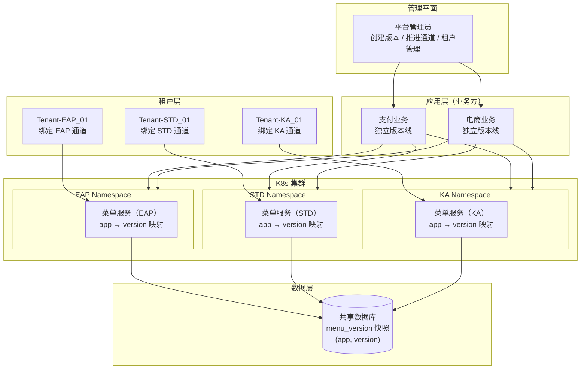

# 菜单中心架构图

## 整体架构



## 多应用 + 单服务实例：按应用映射

```mermaid
graph LR
    subgraph CONTEXT["STD 服务实例的请求"]
        T_STD["Tenant-STD_01<br/>订阅：支付 + 电商"]
    end

    subgraph SVC["STD Namespace 菜单服务"]
        SVC["{支付: v5, 电商: v2}"]
    end

    subgraph DB2["数据库"]
        DB_A["支付 v5"]
        DB_B["支付 v4"]
        DB_C["电商 v2"]
    end

    T_STD -->|app=支付| SVC
    T_STD -->|app=电商| SVC
    SVC -->|按 app + version 查询| DB2

    style SVC fill:#2f6fed,color:#fff
```

STD 服务实例通过应用-版本映射同时服务支付和电商。支付推进到 v5 不会改变电商的 v2；如果支付还需要独立升级服务代码，再将支付绑定到独立运行组。
